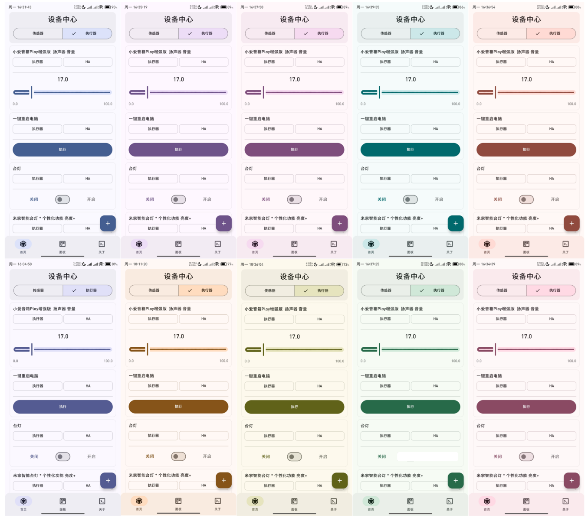

# AIoT-APP

  

## 📱 项目简介

AIoT-APP是一款使用Kotlin开发的Material Design 3原生安卓应用程序，旨在为智能家居和物联网设备提供现代化、高度可定制的控制界面。

### ✨ 主要特点

- 🔄 支持MQTT V3.1.1协议通信
- 🏠 集成HomeAssistant官方REST API
- 🎨 符合Material Design 3设计规范
- 🔧 高度自定义的用户界面
- 📱 原生Android开发体验

## 🚀 功能

- 实时监控与控制IoT设备
- 自定义仪表盘
- 智能场景设置
- 设备分组管理
- 自动化规则配置

## 🛠️ 技术栈

- Kotlin
- Jetpack Compose
- MQTT客户端
- Retrofit网络请求
- Room数据持久化
- Material 3组件库

## 📋 使用说明

### 安装要求

- Android 6.0 (API 23)及以上
- 联网权限

### 快速开始

1. 下载并安装应用
2. 配置MQTT服务器或HomeAssistant连接信息
3. 添加您的智能设备
4. 开始控制您的智能家居

## 🤝 贡献

欢迎提交问题和贡献代码，请参阅[贡献指南](CONTRIBUTING.md)。

## 📄 许可证

本项目基于MIT许可证 - 详情请参阅[LICENSE](LICENSE)文件。