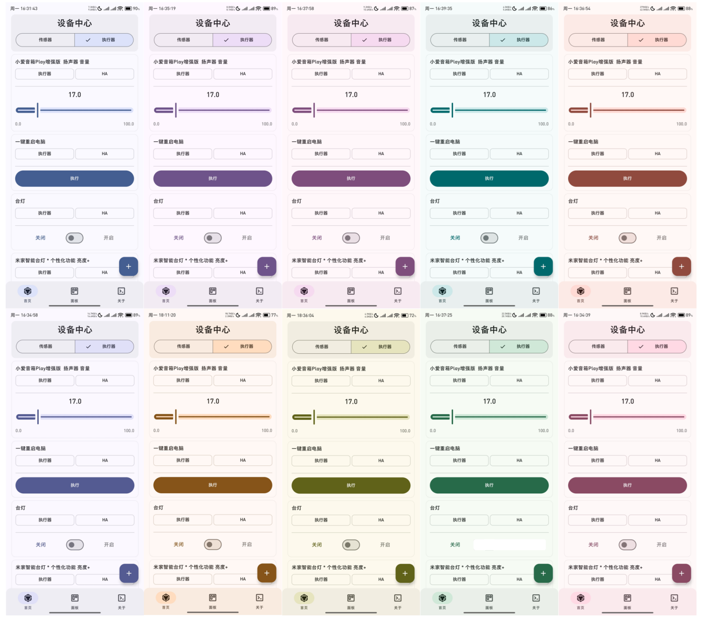

# AIoT-APP

<div align="center">



</div>

## 项目简介

AIoT-APP 是一个使用 Kotlin 与 Jetpack Compose 构建的原生 Android 智能家居控制应用。

当前项目聚焦三个核心场景：

- MQTT 设备连接、订阅与消息下发
- Home Assistant 设备发现与状态轮询
- 基于 WebSocket 的视频流测试与显示

## 当前实现

- 单 Activity + Navigation Compose 类型安全路由
- Material 3 Compose 界面
- Hilt 依赖注入
- ViewModel + StateFlow + Channel/Effect 的页面状态管理
- Room 持久化设备卡片与传感器历史记录
- SharedPreferences 持久化 MQTT、HA、主题与视频流配置
- MQTT 执行器与传感器卡片动态渲染
- Home Assistant 设备拉取、添加与轮询状态同步
- WebSocket 视频流地址测试与实时画面显示
- 深色模式、主题色、圆角层级、后台保活等应用设置

## 技术栈

- Kotlin
- Jetpack Compose + Material 3
- Navigation Compose
- Hilt
- Room
- HiveMQ MQTT Client
- OkHttp / WebSocket
- Timber
- KSP
- ktlint

## 运行要求

- Android 8.0 及以上（`minSdk 26`）
- `compileSdk 36`
- `targetSdk 36`
- Java 21+

## 本地运行

1. 使用 Android Studio 打开项目根目录。
2. 等待 Gradle 同步完成。
3. 运行 `app` 模块到模拟器或真机。

## 常用命令

```powershell
# 仅检查 Kotlin 编译
./gradlew :app:compileDebugKotlin --no-daemon

# 构建 Debug APK
./gradlew :app:assembleDebug --no-daemon

# 代码风格检查
./gradlew ktlintCheck --no-daemon

# 自动格式化
./gradlew ktlintFormat --no-daemon
```

## 主要页面

- `设备中心`
  - 展示传感器与执行器卡片
  - 支持添加、编辑、删除设备卡片
  - 支持查看传感器历史记录
- `MQTT 连接设置`
  - 配置服务器地址、端口、Client ID、用户名、密码
  - 支持 MQTT 3.1.1 / 5.0 切换
  - 支持自动连接
- `Home Assistant`
  - 配置服务地址、访问令牌、轮询间隔
  - 拉取实体列表并添加为设备卡片
- `Video Stream`
  - 配置 WebSocket 地址
  - 测试连接并显示实时图像帧
- `Settings / Theme / About / Changelog / Bluetooth`
  - 应用外观、保活、关于信息、更新日志与蓝牙扫描相关页面

## 状态与持久化

- `Room`
  - `subscription_cards`：设备卡片配置
  - `sensor_history`：传感器历史记录
- `SharedPreferences`
  - MQTT 配置
  - Home Assistant 配置
  - 应用设置
  - 执行器开关/滑块状态
  - 视频流配置

## 交互提示

项目当前同时使用两类提示方式：

- Compose 页面内的 `Snackbar`
- 个别页面中的原生 `Toast`

这部分还没有完全统一。

## 项目结构

```text
app/src/main/java/compose/iot/
├── AiotApp.kt                         # Application 入口（Hilt）
├── MainActivity.kt                    # 单 Activity 入口与导航宿主
├── di/
│   └── AppModule.kt                   # Hilt 模块
├── navigation/
│   └── AppDestination.kt              # 类型安全路由定义
├── data/
│   ├── homeassistant/
│   │   └── HomeAssistantRepository.kt
│   ├── preferences/
│   │   └── PreferencesManager.kt
│   ├── room/
│   │   ├── AppDatabase.kt
│   │   ├── Converters.kt
│   │   ├── SensorHistoryDao.kt
│   │   ├── SensorHistoryEntity.kt
│   │   └── SubscriptionCardDao.kt
│   └── video/
│       └── VideoStreamRepository.kt
├── mqtt/
│   ├── HomeAssistantManager.kt
│   ├── MqttForegroundService.kt
│   ├── MqttManager.kt
│   ├── SensorHistoryData.kt
│   ├── SensorHistoryManager.kt
│   └── SubscriptionCard.kt
├── ui/
│   ├── app/
│   │   ├── AppSettings.kt
│   │   ├── AppSettingsState.kt
│   │   └── AppSettingsViewModel.kt
│   ├── components/
│   │   ├── AppScaffold.kt
│   │   ├── InputCardContent.kt
│   │   ├── PushButtonCardContent.kt
│   │   ├── SensorCardContent.kt
│   │   ├── SliderCardContent.kt
│   │   └── SwitchCardContent.kt
│   ├── theme/
│   │   ├── function/
│   │   ├── page/
│   │   └── ui/theme/
│   └── viewmodel/
│       ├── HomeAssistantViewModel.kt
│       ├── IndexUiState.kt
│       ├── IndexViewModel.kt
│       └── VideoStreamViewModel.kt
```

## 目前已知的工程现状

- `Room` 仍然使用 `fallbackToDestructiveMigration()`，数据库升级策略还比较粗放。
- 部分中文文案存在编码历史问题，源码里仍有少量乱码待清理。
- 还没有成体系的单元测试或 UI 测试。

## 许可证

本项目使用 [MIT License](LICENSE)。
